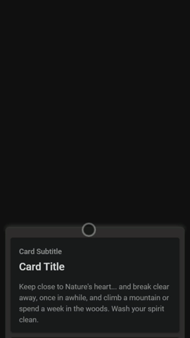

# Stencil Bottom Drawer

Bottom Drawer WebComponent. 



## Installation
---
<br>

```
$ npm i @zoff-tech/zt-bottom-drawer
```

<br>
<br>

## Properties
---
<br>

| Property              | Attribute                | Description | Type                                                                   | Default                           |
| --------------------- | ------------------------ | ----------- | ---------------------------------------------------------------------- | --------------------------------- |
| `autoHeightContent`   | `auto-height-content`    |             | `boolean`                                                              | `true`                            |
| `disableMove`         | `disable-move`           |             | `boolean`                                                              | `false`                           |
| `distanceBottomClose` | `distance-bottom-close`  |             | `number`                                                               | `60`                              |
| `distanceBottomOpen`  | `distance-bottom-open`   |             | `number`                                                               | `350`                             |
| `distanceTopFullOpen` | `distance-top-full-open` |             | `number`                                                               | `10`                              |
| `easing`              | `easing`                 |             | `string`                                                               | `'cubic-bezier(.56,.05,.91,.88)'` |
| `state`               | `state`                  |             | `ZTDrawerState.BOTTOM \| ZTDrawerState.FULLOPEN \| ZTDrawerState.OPEN` | `ZTDrawerState.BOTTOM`            |

<br>
<br>

## Events
---
<br>

| Event         | Description | Type                                                                                |
| ------------- | ----------- | ----------------------------------------------------------------------------------- |
| `changeState` |             | `CustomEvent<ZTDrawerState.BOTTOM \| ZTDrawerState.FULLOPEN \| ZTDrawerState.OPEN>` |
| `closeBottom` |             | `CustomEvent<void>`                                                                 |


<br>
<br>

## Methods
---
<br>

``` javascript
addCallbackCanActivateState(callback: (state: ZTDrawerState, oldState: ZTDrawerState, drawerElement: HTMLElement, contentElement: HTMLElement) => Promise<boolean | void> | void) => Promise<void>`
```
#### Returns
Type: `Promise<void>`

<br>
<br>

``` javascript
addCallbackCanDeactivateState(callback: (state: ZTDrawerState, newState: ZTDrawerState, drawerElement: HTMLElement, contentElement: HTMLElement) => Promise<boolean | void> | void) => Promise<void>`
```
#### Returns
Type: `Promise<void>`

<br>
<br>

## HTML Element target gesture / Container
---
<br>

The element with the class drawer-gesture-target receives the event (touch) that moves the drawer.

```html
        <ion-card-header class="drawer-gesture-target">
          <ion-card-subtitle style="font-size: 17px;">Title Drawer</ion-card-title>
        </ion-card-header>
````

The element that has the class drawer-content will change the height between states, that is necessary for support scroll behaviour.

```html
    <ion-card-content class="drawer-content ion-no-padding">
          <ion-content class="drawer-content-card">
            <ion-card>
              <ion-card-header>
                <ion-card-subtitle>Card Subtitle</ion-card-subtitle>
                <ion-card-title>Card Title</ion-card-title>
              </ion-card-header>
              <ion-card-content>
                Keep close to Nature's heart... and break clear away, once in awhile,
                and climb a mountain or spend a week in the woods. Wash your spirit clean.
              </ion-card-content>
            </ion-card>
            <ion-card>
              <ion-card-header>
                <ion-card-subtitle>Card Subtitle</ion-card-subtitle>
                <ion-card-title>Card Title</ion-card-title>
              </ion-card-header>
              <ion-card-content>
                Keep close to Nature's heart... and break clear away, once in awhile,
                and climb a mountain or spend a week in the woods. Wash your spirit clean.
              </ion-card-content>
            </ion-card>           
          </ion-content>
        </ion-card-content>
````

<br>
<br>

## Activate and Deactivate states control. 
---
<br>

If the callback promise resolves to false the state change is canceled.

### Methods 

```javascript

    callbackCanActivateState: (state: ZTDrawerState, drawerElement: HTMLElement, contentElement: HTMLElement) => Promise<boolean | undefined> | undefined;
    callbackCanDeactivateState: (state: ZTDrawerState, drawerElement: HTMLElement,  contentElement: HTMLElement) => Promise<boolean | undefined> | undefined;


```
### Example in StencilJS

```javascript

  componentDidLoad() {
    this.drawer.addCallbackCanActivateState(this.callbackCanActivateChangeState);
    this.drawer.addCallbackCanDeactivateState(this.callbackCanDeactivateChangeState);
  }
  
  async callbackCanDeactivateChangeState(state: string, newState: string, drawerElement: HTMLElement, content: HTMLElement): Promise<boolean> {
    if(state==="TOP"){
      return false; 
    }
    return true;
   }

  async callbackCanActivateChangeState(state: string, oldState: string, drawerElement: HTMLElement, content: HTMLElement): Promise<boolean> {
    return true;
  }

```
<br>
<br>

# Examples

### PLAIN HTML

```html
<body style="overflow: hidden; height: 100vh;" class="dark md">
  <div id="loader">
    <div></div>
    <div></div>
  </div>
  <zt-bottom-drawer id="drawer" distance-bottom-close="210" distance-top-full-open="50">
    <div slot="drawer-content">
      <ion-content class="drawer-content">
        <ion-card class="card-close">
          <ion-card-header>
            <ion-card-subtitle>Card Subtitle</ion-card-subtitle>
            <ion-card-title>Card Title</ion-card-title>
          </ion-card-header>
          <ion-card-content>
            Keep close to Nature's heart... and break clear away, once in awhile,
            and climb a mountain or spend a week in the woods. Wash your spirit clean.
          </ion-card-content>
        </ion-card>
        <ion-card>
          <ion-card-header>
            <ion-card-subtitle>Card Subtitle</ion-card-subtitle>
            <ion-card-title>Card Title</ion-card-title>
          </ion-card-header>
          <ion-card-content>
            Keep close to Nature's heart... and break clear away, once in awhile,
            and climb a mountain or spend a week in the woods. Wash your spirit clean.
          </ion-card-content>
        </ion-card>
        <ion-card>
          <ion-card-header>
            <ion-card-subtitle>Card Subtitle</ion-card-subtitle>
            <ion-card-title>Card Title</ion-card-title>
          </ion-card-header>
          <ion-card-content>
            Keep close to Nature's heart... and break clear away, once in awhile,
            and climb a mountain or spend a week in the woods. Wash your spirit clean.
          </ion-card-content>
        </ion-card>
      </ion-content>
    </div>
  </zt-bottom-drawer>

  <script>
    window.onload = () => {
      let drawer = document.getElementById("drawer");

      drawer.addEventListener("closeBottom", () => { console.log("close drawer") });
      drawer.addEventListener("changeState", () => { console.log("change state") });

      drawer.addCallbackCanDeactivateState((state, newState, drawer, content) => {
        console.log("DeactivateState", state, drawer, content);
        return true;
      });

      drawer.addCallbackCanActivateState((state, oldState, drawer, content) => {
        console.log("ActivateState", state, drawer, content);
        if (state === "FULLOPEN") {
          return new Promise((resolve) => {
            document.getElementById("loader").classList.add("lds-ripple");
            setTimeout(() => {
              document.getElementById("loader").classList.remove("lds-ripple");
              resolve(true);
            }, 100 * (Math.random() * (8 - 4) + 4));
          });
        }
        return true;
      });
    }
  </script>
</body>
```

![Built With Stencil](https://img.shields.io/badge/-Built%20With%20Stencil-16161d.svg?logo=data%3Aimage%2Fsvg%2Bxml%3Bbase64%2CPD94bWwgdmVyc2lvbj0iMS4wIiBlbmNvZGluZz0idXRmLTgiPz4KPCEtLSBHZW5lcmF0b3I6IEFkb2JlIElsbHVzdHJhdG9yIDE5LjIuMSwgU1ZHIEV4cG9ydCBQbHVnLUluIC4gU1ZHIFZlcnNpb246IDYuMDAgQnVpbGQgMCkgIC0tPgo8c3ZnIHZlcnNpb249IjEuMSIgaWQ9IkxheWVyXzEiIHhtbG5zPSJodHRwOi8vd3d3LnczLm9yZy8yMDAwL3N2ZyIgeG1sbnM6eGxpbms9Imh0dHA6Ly93d3cudzMub3JnLzE5OTkveGxpbmsiIHg9IjBweCIgeT0iMHB4IgoJIHZpZXdCb3g9IjAgMCA1MTIgNTEyIiBzdHlsZT0iZW5hYmxlLWJhY2tncm91bmQ6bmV3IDAgMCA1MTIgNTEyOyIgeG1sOnNwYWNlPSJwcmVzZXJ2ZSI%2BCjxzdHlsZSB0eXBlPSJ0ZXh0L2NzcyI%2BCgkuc3Qwe2ZpbGw6I0ZGRkZGRjt9Cjwvc3R5bGU%2BCjxwYXRoIGNsYXNzPSJzdDAiIGQ9Ik00MjQuNywzNzMuOWMwLDM3LjYtNTUuMSw2OC42LTkyLjcsNjguNkgxODAuNGMtMzcuOSwwLTkyLjctMzAuNy05Mi43LTY4LjZ2LTMuNmgzMzYuOVYzNzMuOXoiLz4KPHBhdGggY2xhc3M9InN0MCIgZD0iTTQyNC43LDI5Mi4xSDE4MC40Yy0zNy42LDAtOTIuNy0zMS05Mi43LTY4LjZ2LTMuNkgzMzJjMzcuNiwwLDkyLjcsMzEsOTIuNyw2OC42VjI5Mi4xeiIvPgo8cGF0aCBjbGFzcz0ic3QwIiBkPSJNNDI0LjcsMTQxLjdIODcuN3YtMy42YzAtMzcuNiw1NC44LTY4LjYsOTIuNy02OC42SDMzMmMzNy45LDAsOTIuNywzMC43LDkyLjcsNjguNlYxNDEuN3oiLz4KPC9zdmc%2BCg%3D%3D&colorA=16161d&style=flat-square)


<br>
<br>
<br>

# License

The MIT License (MIT)

Copyright (c) 2020 Rodrigo Zoff

Permission is hereby granted, free of charge, to any person obtaining a copy of this software and associated documentation files (the "Software"), to deal in the Software without restriction, including without limitation the rights to use, copy, modify, merge, publish, distribute, sublicense, and/or sell copies of the Software, and to permit persons to whom the Software is furnished to do so, subject to the following conditions:

The above copyright notice and this permission notice shall be included in all copies or substantial portions of the Software.

THE SOFTWARE IS PROVIDED "AS IS", WITHOUT WARRANTY OF ANY KIND, EXPRESS OR IMPLIED, INCLUDING BUT NOT LIMITED TO THE WARRANTIES OF MERCHANTABILITY, FITNESS FOR A PARTICULAR PURPOSE AND NONINFRINGEMENT. IN NO EVENT SHALL THE AUTHORS OR COPYRIGHT HOLDERS BE LIABLE FOR ANY CLAIM, DAMAGES OR OTHER LIABILITY, WHETHER IN AN ACTION OF CONTRACT, TORT OR OTHERWISE, ARISING FROM, OUT OF OR IN CONNECTION WITH THE SOFTWARE OR THE USE OR OTHER DEALINGS IN THE SOFTWARE.

