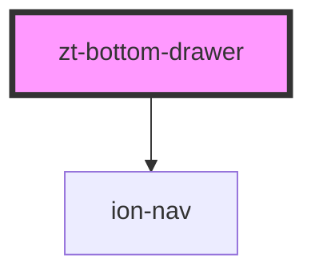

# zt-bottom-drawer

<!-- Auto Generated Below -->

## Properties

| Property             | Attribute               | Description | Type      | Default                                           |
| -------------------- | ----------------------- | ----------- | --------- | ------------------------------------------------- |
| `allowScroll`        | `allow-scroll`          |             | `boolean` | `true`                                            |
| `coefAnimationTime`  | `coef-animation-time`   |             | `number`  | `40`                                              |
| `disableGesture`     | `disable-gesture`       |             | `boolean` | `false`                                           |
| `fixCurrentPosition` | `fix-current-position`  |             | `boolean` | `false`                                           |
| `hidden`             | `hidden`                |             | `boolean` | `false`                                           |
| `hideOnPositionZero` | `hide-on-position-zero` |             | `boolean` | `false`                                           |
| `positionName`       | `position-name`         |             | `string`  | `undefined`                                       |
| `positions`          | `positions`             |             | `string`  | `"close-b-10,bottom-b-200,middle-b-450,top-t-60"` |
| `safeAreaBottom`     | `safe-area-bottom`      |             | `number`  | `undefined`                                       |
| `safeAreaTop`        | `safe-area-top`         |             | `number`  | `undefined`                                       |

## Events

| Event                   | Description | Type                                                                                                   |
| ----------------------- | ----------- | ------------------------------------------------------------------------------------------------------ |
| `ztChangePositionEvent` |             | `CustomEvent<{ positionName: string; lastPositionName: string; htmlElements: ZTHTMLElementsDrawer; }>` |
| `ztHideEvent`           |             | `CustomEvent<{ drawer: HTMLElement; gestureTarget: HTMLElement; content: HTMLElement; }>`              |
| `ztNavDidChange`        |             | `CustomEvent<any>`                                                                                     |
| `ztNavWillChange`       |             | `CustomEvent<any>`                                                                                     |

## Methods

### `getActiveComponentTagName() => Promise<string>`

#### Returns

Type: `Promise<string>`

### `getCurrentIndex() => Promise<number>`

#### Returns

Type: `Promise<number>`

### `getCurrrentPositionDto() => Promise<ZTPositionDrawer>`

#### Returns

Type: `Promise<ZTPositionDrawer>`

### `getNav() => Promise<HTMLIonNavElement>`

#### Returns

Type: `Promise<HTMLIonNavElement>`

### `getNavActive() => Promise<ViewController>`

#### Returns

Type: `Promise<ViewController>`

### `getNavCurrentComponent() => Promise<any>`

#### Returns

Type: `Promise<any>`

### `getPositionByIndex(index: number) => Promise<ZTPositionDrawer>`

#### Returns

Type: `Promise<ZTPositionDrawer>`

### `getPositionByName(name: string) => Promise<ZTPositionDrawer>`

#### Returns

Type: `Promise<ZTPositionDrawer>`

### `goBack(amountBack?: number, opts?: NavOptions | null | undefined, done?: TransitionDoneFn | undefined) => Promise<Boolean>`

#### Returns

Type: `Promise<Boolean>`

### `goBackToIndex(index: number, opts?: NavOptions | null | undefined, done?: TransitionDoneFn | undefined) => Promise<Boolean>`

#### Returns

Type: `Promise<Boolean>`

### `goBackToRoot(opts?: NavOptions | null | undefined, done?: TransitionDoneFn | undefined) => Promise<Boolean>`

#### Returns

Type: `Promise<Boolean>`

### `hide() => Promise<void>`

#### Returns

Type: `Promise<void>`

### `pushNav(component: string | HTMLElement, propsComponent: any, options: PushNavOptions) => Promise<boolean>`

#### Returns

Type: `Promise<boolean>`

### `refreshSizeContent() => Promise<void>`

#### Returns

Type: `Promise<void>`

### `saveStateInActiveComponent() => Promise<void>`

#### Returns

Type: `Promise<void>`

### `setPosition(value: ZTPositionDrawer, force?: boolean) => Promise<void>`

#### Returns

Type: `Promise<void>`

### `setPositionByName(name: string, force?: boolean) => Promise<void>`

#### Returns

Type: `Promise<void>`

### `setScrollToTop(duration?: number) => Promise<void>`

#### Returns

Type: `Promise<void>`

### `setTranslateY(posY: number, applyAnimation?: boolean) => Promise<void>`

#### Returns

Type: `Promise<void>`

### `show(positionName: string) => Promise<void>`

#### Returns

Type: `Promise<void>`

## Dependencies

### Depends on

- ion-nav

### Graph

----------------------------------------------

*Built with [StencilJS](https://stenciljs.com/)*
