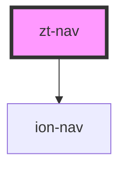

# zt-nav

<!-- Auto Generated Below -->

## Methods

### `getActive() => Promise<ViewController>`

#### Returns

Type: `Promise<ViewController>`

### `getNav() => Promise<HTMLIonNavElement>`

#### Returns

Type: `Promise<HTMLIonNavElement>`

### `pushNav<T extends NavComponent>(component: any, componentProps?: ComponentProps<T> | null | undefined, opts?: NavOptions | null | undefined, done?: TransitionDoneFn | undefined) => Promise<boolean>`

#### Returns

Type: `Promise<boolean>`

## Dependencies

### Depends on

- ion-nav

### Graph

----------------------------------------------

*Built with [StencilJS](https://stenciljs.com/)*
